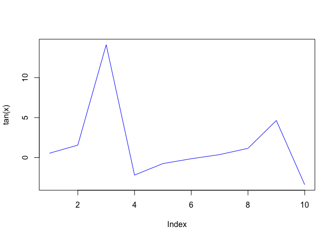

Class: R Function
================
Joan M Valls Cuevas
4/19/2019

Overview
--------

Today we will focus on R functions. We will start with a bit of file reading

``` r
x <- 1:10/2
plot(tan(x), type = "l", col = "blue")
```

 Opening test1 using read.table() and modifying the conditions to fit the document

``` r
read.table("test1.txt", sep = ",", header = TRUE)
```

    ##   Col1 Col2 Col3
    ## 1    1    2    3
    ## 2    4    5    6
    ## 3    7    8    9
    ## 4    a    b    c

A space and a tab does not need any special separators

``` r
read.table("test3.txt")
```

    ##   V1 V2 V3
    ## 1  1  6  a
    ## 2  2  7  b
    ## 3  3  8  c
    ## 4  4  9  d
    ## 5  5 10  e

A **$** sign was used as a separator in this example

``` r
read.table("test2.txt", sep = "$", header = TRUE)
```

    ##   Col1 Col2 Col3
    ## 1    1    2    3
    ## 2    4    5    6
    ## 3    7    8    9
    ## 4    a    b    c

``` r
read.csv("https://bioboot.github.io/bggn213_S19/class-material/test1.txt")
```

    ##   Col1 Col2 Col3
    ## 1    1    2    3
    ## 2    4    5    6
    ## 3    7    8    9
    ## 4    a    b    c

Our first function
------------------

Add some numbers

``` r
add <- function(x=0, y=0) {
  #The body of the function
  return(x + y)
  
}
```

``` r
add()
```

    ## [1] 0

``` r
add(c(1,3,5), 1)
```

    ## [1] 2 4 6

Too many arguments

``` r
#add(1,3,5)
```

``` r
## You need a “name”, “arguments” and “body”...
rescale <- function(x) {
   rng <-range(x)
   (x - rng[1]) / (rng[2] - rng[1])
}
```

``` r
# Test on a small example where you know the answer
rescale(1:10)
```

    ##  [1] 0.0000000 0.1111111 0.2222222 0.3333333 0.4444444 0.5555556 0.6666667
    ##  [8] 0.7777778 0.8888889 1.0000000

``` r
## You need a “name”, “arguments” and “body”...
rescale2 <- function(x, na.rm = TRUE) {
   rng <-range(x, na.rm = na.rm)
   (x - rng[1]) / (rng[2] - rng[1])
}
```

``` r
rescale3 <- function(x, na.rm=TRUE, plot=FALSE) {
   if(na.rm) {
     rng <-range(x, na.rm=TRUE)
   } else {
     rng <-range(x)
   }
   print("Hello")
   answer <- (x - rng[1]) / (rng[2] - rng[1])
   print("is it me you are looking for?")
   if(plot) {
      plot(answer, typ="b", lwd=4)
      print("Plot has been drawn")
}
   print("I can see it in ...")
   return(answer)
}
```

``` r
doStuff <- function(x, typ="l", sse=sse, chain="A", ylab="Bfactor", elety="CA") { 

library("bio3d") #upload bio3d 
  
s1 <- read.pdb(x)  # kinase with drug

s1.chain <- trim.pdb(s1, chain=chain, elety=elety) 

s1.b <- s1.chain$atom$b

plotb3(s1.b, sse=s1.chainA, typ=typ, ylab=ylab)


}
```

``` r
library("bio3d")
s1 <- read.pdb("4AKE")
```

    ##   Note: Accessing on-line PDB file

``` r
s1
```

    ## 
    ##  Call:  read.pdb(file = "4AKE")
    ## 
    ##    Total Models#: 1
    ##      Total Atoms#: 3459,  XYZs#: 10377  Chains#: 2  (values: A B)
    ## 
    ##      Protein Atoms#: 3312  (residues/Calpha atoms#: 428)
    ##      Nucleic acid Atoms#: 0  (residues/phosphate atoms#: 0)
    ## 
    ##      Non-protein/nucleic Atoms#: 147  (residues: 147)
    ##      Non-protein/nucleic resid values: [ HOH (147) ]
    ## 
    ##    Protein sequence:
    ##       MRIILLGAPGAGKGTQAQFIMEKYGIPQISTGDMLRAAVKSGSELGKQAKDIMDAGKLVT
    ##       DELVIALVKERIAQEDCRNGFLLDGFPRTIPQADAMKEAGINVDYVLEFDVPDELIVDRI
    ##       VGRRVHAPSGRVYHVKFNPPKVEGKDDVTGEELTTRKDDQEETVRKRLVEYHQMTAPLIG
    ##       YYSKEAEAGNTKYAKVDGTKPVAEVRADLEKILGMRIILLGAPGA...<cut>...KILG
    ## 
    ## + attr: atom, xyz, seqres, helix, sheet,
    ##         calpha, remark, call

``` r
s1.chain <- trim.pdb(s1, chain="A", elety="CA")
s1.chain
```

    ## 
    ##  Call:  trim.pdb(pdb = s1, chain = "A", elety = "CA")
    ## 
    ##    Total Models#: 1
    ##      Total Atoms#: 214,  XYZs#: 642  Chains#: 1  (values: A)
    ## 
    ##      Protein Atoms#: 214  (residues/Calpha atoms#: 214)
    ##      Nucleic acid Atoms#: 0  (residues/phosphate atoms#: 0)
    ## 
    ##      Non-protein/nucleic Atoms#: 0  (residues: 0)
    ##      Non-protein/nucleic resid values: [ none ]
    ## 
    ##    Protein sequence:
    ##       MRIILLGAPGAGKGTQAQFIMEKYGIPQISTGDMLRAAVKSGSELGKQAKDIMDAGKLVT
    ##       DELVIALVKERIAQEDCRNGFLLDGFPRTIPQADAMKEAGINVDYVLEFDVPDELIVDRI
    ##       VGRRVHAPSGRVYHVKFNPPKVEGKDDVTGEELTTRKDDQEETVRKRLVEYHQMTAPLIG
    ##       YYSKEAEAGNTKYAKVDGTKPVAEVRADLEKILG
    ## 
    ## + attr: atom, helix, sheet, seqres, xyz,
    ##         calpha, call

``` r
s1.b <- s1.chain$atom$b
s1.b
```

    ##   [1]  29.02  18.44  16.20  19.67  20.26  20.55  17.05  22.13  26.71  33.05
    ##  [11]  30.66  32.73  25.61  33.19  41.03  24.09  16.18  19.14  29.19  14.79
    ##  [21]  19.63  28.54  27.49  32.56  17.13  15.50   6.98  24.07  24.00  23.94
    ##  [31]  30.70  24.70  32.84  34.60  33.01  44.60  50.74  57.32  47.04  67.13
    ##  [41]  81.04  75.20  59.68  55.63  45.12  39.04  44.31  38.21  43.70  44.19
    ##  [51]  47.00  48.67  41.54  50.22  45.07  49.77  52.04  44.82  39.75  35.79
    ##  [61]  38.92  37.93  27.18  26.86  27.53  31.16  27.08  23.03  28.12  24.78
    ##  [71]  24.22  18.69  40.67  38.08  55.26  46.29  26.25  37.14  27.50  16.86
    ##  [81]  27.76  19.27  22.22  26.70  25.52  21.22  15.90  15.84  22.44  19.61
    ##  [91]  21.23  21.79  17.64  22.19  22.73  16.80  23.25  35.95  24.42  20.96
    ## [101]  20.00  25.99  24.39  17.19  12.16  17.35  24.97  14.08  22.01  22.26
    ## [111]  22.78  27.47  30.49  32.02  20.90  27.03  23.84  44.37  42.47  33.48
    ## [121]  44.56  56.67  60.18  66.62  59.95  70.81  88.63 100.11  86.60  85.80
    ## [131]  77.48  68.13  52.66  45.34  52.43  60.90  62.64  72.19  66.75  58.73
    ## [141]  74.57  79.29  79.53  76.58  66.40  64.76  70.48  74.84  70.11  74.82
    ## [151]  78.61  78.24  66.70  66.10  67.01  72.28  80.64  68.54  43.23  51.24
    ## [161]  45.72  61.60  45.61  42.57  41.03  41.02  33.34  19.48  34.38  33.11
    ## [171]  25.48  29.68  40.71  32.91  24.41  19.20  15.43  19.93  20.66  12.72
    ## [181]  21.40  18.21  26.68  34.50  25.77  26.52  36.85  31.05  39.84  48.03
    ## [191]  23.04  29.57  23.00  23.80  26.59  25.49  23.25  19.89  32.37  30.97
    ## [201]  42.16  29.64  29.69  33.15  26.38  23.17  29.35  32.80  25.92  38.01
    ## [211]  45.95  44.26  44.35  70.26
