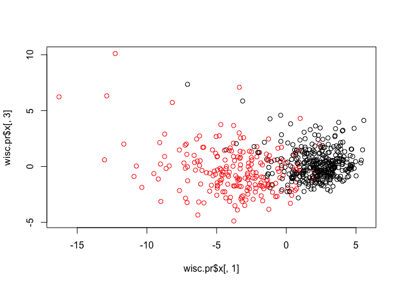
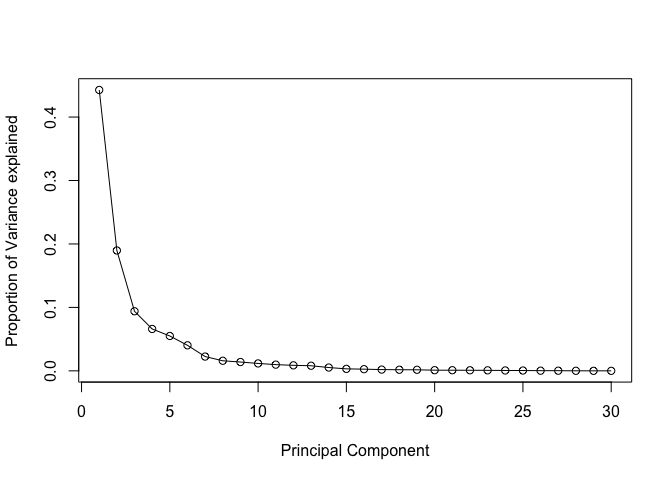
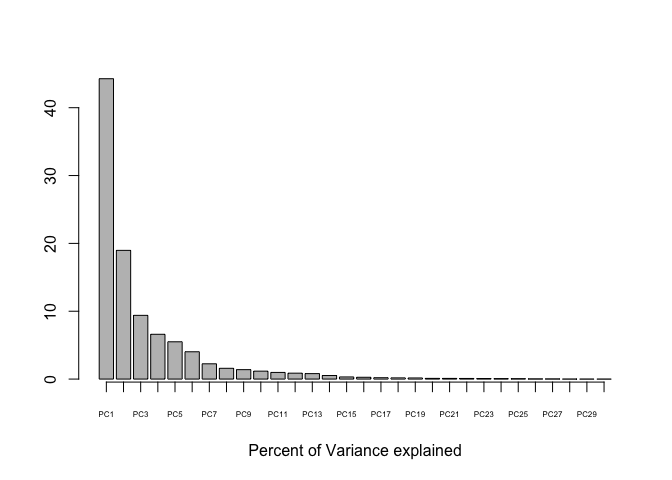
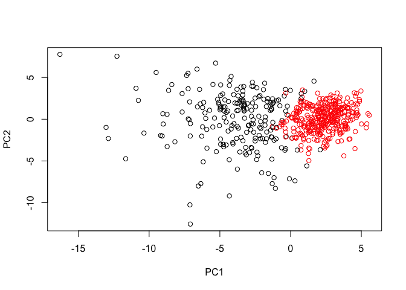

Unsupervised\_learning\_2
================
Joan M. Valls Cuevas
5/1/2019

Unsupervised learning 2
=======================

``` r
wisc.df <- read.csv("WisconsinCancer.csv")
```

Q3

``` r
wisc.data <- as.matrix(wisc.df[,3:32])
```

``` r
length(grep("_mean", colnames(wisc.df)))
```

    ## [1] 10

``` r
row.names(wisc.data) <- wisc.df$id
```

``` r
diagnosis <- wisc.df$diagnosis
```

Check the mean of the columns in order to see if scaling is appropriate

``` r
round(colMeans(wisc.data), 1)
```

    ##             radius_mean            texture_mean          perimeter_mean 
    ##                    14.1                    19.3                    92.0 
    ##               area_mean         smoothness_mean        compactness_mean 
    ##                   654.9                     0.1                     0.1 
    ##          concavity_mean     concave.points_mean           symmetry_mean 
    ##                     0.1                     0.0                     0.2 
    ##  fractal_dimension_mean               radius_se              texture_se 
    ##                     0.1                     0.4                     1.2 
    ##            perimeter_se                 area_se           smoothness_se 
    ##                     2.9                    40.3                     0.0 
    ##          compactness_se            concavity_se       concave.points_se 
    ##                     0.0                     0.0                     0.0 
    ##             symmetry_se    fractal_dimension_se            radius_worst 
    ##                     0.0                     0.0                    16.3 
    ##           texture_worst         perimeter_worst              area_worst 
    ##                    25.7                   107.3                   880.6 
    ##        smoothness_worst       compactness_worst         concavity_worst 
    ##                     0.1                     0.3                     0.3 
    ##    concave.points_worst          symmetry_worst fractal_dimension_worst 
    ##                     0.1                     0.3                     0.1

``` r
#apply(wisc.data, 1 for row 2 for col, SD or mean etc)
```

Create a PCA plot and scaling as appropriate

``` r
wisc.pr <- prcomp(wisc.data, scale. = TRUE)
```

Summary of the PCA data

``` r
summary(wisc.pr)
```

    ## Importance of components:
    ##                           PC1    PC2     PC3     PC4     PC5     PC6
    ## Standard deviation     3.6444 2.3857 1.67867 1.40735 1.28403 1.09880
    ## Proportion of Variance 0.4427 0.1897 0.09393 0.06602 0.05496 0.04025
    ## Cumulative Proportion  0.4427 0.6324 0.72636 0.79239 0.84734 0.88759
    ##                            PC7     PC8    PC9    PC10   PC11    PC12
    ## Standard deviation     0.82172 0.69037 0.6457 0.59219 0.5421 0.51104
    ## Proportion of Variance 0.02251 0.01589 0.0139 0.01169 0.0098 0.00871
    ## Cumulative Proportion  0.91010 0.92598 0.9399 0.95157 0.9614 0.97007
    ##                           PC13    PC14    PC15    PC16    PC17    PC18
    ## Standard deviation     0.49128 0.39624 0.30681 0.28260 0.24372 0.22939
    ## Proportion of Variance 0.00805 0.00523 0.00314 0.00266 0.00198 0.00175
    ## Cumulative Proportion  0.97812 0.98335 0.98649 0.98915 0.99113 0.99288
    ##                           PC19    PC20   PC21    PC22    PC23   PC24
    ## Standard deviation     0.22244 0.17652 0.1731 0.16565 0.15602 0.1344
    ## Proportion of Variance 0.00165 0.00104 0.0010 0.00091 0.00081 0.0006
    ## Cumulative Proportion  0.99453 0.99557 0.9966 0.99749 0.99830 0.9989
    ##                           PC25    PC26    PC27    PC28    PC29    PC30
    ## Standard deviation     0.12442 0.09043 0.08307 0.03987 0.02736 0.01153
    ## Proportion of Variance 0.00052 0.00027 0.00023 0.00005 0.00002 0.00000
    ## Cumulative Proportion  0.99942 0.99969 0.99992 0.99997 1.00000 1.00000

Creating a biplot of data

``` r
biplot(wisc.pr)
```


``` r
plot(wisc.pr$x[,1], wisc.pr$x[,2], col = diagnosis)
```


``` r
plot(wisc.pr$x[,1], wisc.pr$x[,3], col = diagnosis)
```



``` r
pr.var <- wisc.pr$sdev^2

pve <- pr.var/sum(pr.var)

plot(pve, type = "o", xlab = "Principal Component", ylab = "Proportion of Variance explained")
```



``` r
barplot(pve*100, xlab = "Percent of Variance explained", names.arg = paste0("PC", 1:30), cex.names = 0.5, axis.lty = 1)
```



``` r
sum(pr.var)
```

    ## [1] 30

``` r
data.scaled <- scale(wisc.data)

data.dist <- dist(data.scaled, method = "euclidean")

wisc.hclust <- hclust(data.dist)

plot(wisc.hclust)
```


``` r
wisc.hclust.clusters <- cutree(wisc.hclust, k = 4)
```

``` r
table(wisc.hclust.clusters, diagnosis)
```

    ##                     diagnosis
    ## wisc.hclust.clusters   B   M
    ##                    1  12 165
    ##                    2   2   5
    ##                    3 343  40
    ##                    4   0   2

Section 5. combining methods (PCA + clustering)
-----------------------------------------------

I am going to start with principal components that capture 90% or more of the origical dataset (PC1 to PC7)

``` r
wisc.pr.hclust <- hclust(dist(wisc.pr$x[,1:7]), method = "ward.D2")
```

Plot the new hierarchical cluster

``` r
plot(wisc.pr.hclust)
```


``` r
grps <- cutree(wisc.pr.hclust, k = 2)

table(grps)
```

    ## grps
    ##   1   2 
    ## 216 353

``` r
table(grps, diagnosis)
```

    ##     diagnosis
    ## grps   B   M
    ##    1  28 188
    ##    2 329  24

``` r
plot(wisc.pr$x[,1:2], col = grps )
```



Section 7: Predicting using new data
------------------------------------

``` r
url <- "https://tinyurl.com/new-samples-CSV"

new <- read.csv(url)

npc <- predict(wisc.pr, newdata=new)
npc
```

    ##            PC1       PC2        PC3        PC4       PC5        PC6
    ## [1,]  2.576616 -3.135913  1.3990492 -0.7631950  2.781648 -0.8150185
    ## [2,] -4.754928 -3.009033 -0.1660946 -0.6052952 -1.140698 -1.2189945
    ##             PC7        PC8       PC9       PC10      PC11      PC12
    ## [1,] -0.3959098 -0.2307350 0.1029569 -0.9272861 0.3411457  0.375921
    ## [2,]  0.8193031 -0.3307423 0.5281896 -0.4855301 0.7173233 -1.185917
    ##           PC13     PC14      PC15       PC16        PC17        PC18
    ## [1,] 0.1610764 1.187882 0.3216974 -0.1743616 -0.07875393 -0.11207028
    ## [2,] 0.5893856 0.303029 0.1299153  0.1448061 -0.40509706  0.06565549
    ##             PC19       PC20       PC21       PC22       PC23       PC24
    ## [1,] -0.08802955 -0.2495216  0.1228233 0.09358453 0.08347651  0.1223396
    ## [2,]  0.25591230 -0.4289500 -0.1224776 0.01732146 0.06316631 -0.2338618
    ##             PC25         PC26         PC27        PC28         PC29
    ## [1,]  0.02124121  0.078884581  0.220199544 -0.02946023 -0.015620933
    ## [2,] -0.20755948 -0.009833238 -0.001134152  0.09638361  0.002795349
    ##              PC30
    ## [1,]  0.005269029
    ## [2,] -0.019015820

``` r
plot(wisc.pr$x[,1:2], col=grps)
points(npc[,1], npc[,2], col="blue", pch=16, cex=3)
text(npc[,1], npc[,2], c(1,2), col="white")
```


``` r
sessionInfo()
```

    ## R version 3.6.0 (2019-04-26)
    ## Platform: x86_64-apple-darwin15.6.0 (64-bit)
    ## Running under: macOS High Sierra 10.13.6
    ## 
    ## Matrix products: default
    ## BLAS:   /Library/Frameworks/R.framework/Versions/3.6/Resources/lib/libRblas.0.dylib
    ## LAPACK: /Library/Frameworks/R.framework/Versions/3.6/Resources/lib/libRlapack.dylib
    ## 
    ## locale:
    ## [1] en_US.UTF-8/en_US.UTF-8/en_US.UTF-8/C/en_US.UTF-8/en_US.UTF-8
    ## 
    ## attached base packages:
    ## [1] stats     graphics  grDevices utils     datasets  methods   base     
    ## 
    ## loaded via a namespace (and not attached):
    ##  [1] compiler_3.6.0  magrittr_1.5    tools_3.6.0     htmltools_0.3.6
    ##  [5] yaml_2.2.0      Rcpp_1.0.1      stringi_1.4.3   rmarkdown_1.13 
    ##  [9] knitr_1.23      stringr_1.4.0   xfun_0.7        digest_0.6.19  
    ## [13] evaluate_0.14
