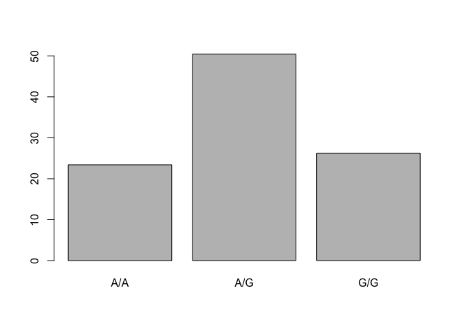
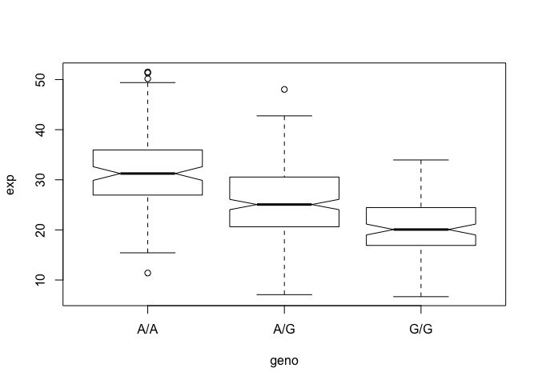

Class13
================
Joan M. Valls Cuevas
5/15/2019

R Markdown
----------

``` r
dat <- read.csv("373531-SampleGenotypes-Homo_sapiens_Variation_Sample_rs8067378.csv")

datf <- data.frame(dat)

table(dat$Genotype..forward.strand.)
```

    ## 
    ## A|A A|G G|A G|G 
    ##  22  21  12   9

``` r
#proportion

round(table(dat$Genotype..forward.strand.)/nrow(dat) * 100,2)
```

    ## 
    ##   A|A   A|G   G|A   G|G 
    ## 34.38 32.81 18.75 14.06

Quality scores in

``` r
library(seqinr)
library(gtools)
s2c("DDDDCDEDCDDDDBBDDDCC@")
```

    ##  [1] "D" "D" "D" "D" "C" "D" "E" "D" "C" "D" "D" "D" "D" "B" "B" "D" "D"
    ## [18] "D" "C" "C" "@"

``` r
phred <- asc( s2c("DDDDCDEDCDDDDBBDDDCC@") ) - 33
```

Section 4

``` r
dataSet <- read.table("rs8067378_ENSG00000172057.6.txt", sep = " ", header = TRUE)
```

``` r
table(dataSet$geno)
```

    ## 
    ## A/A A/G G/G 
    ## 108 233 121

``` r
barplot(round(table(dataSet$geno)/nrow(dataSet) *100,2))
```



``` r
dataSet2 <- dataSet[dataSet$geno == "G/G",]

summary(dataSet2$exp)
```

    ##    Min. 1st Qu.  Median    Mean 3rd Qu.    Max. 
    ##   6.675  16.903  20.074  20.594  24.457  33.956

``` r
dataSet3 <- dataSet[dataSet$geno == "A/A",]

summary(dataSet3$exp)
```

    ##    Min. 1st Qu.  Median    Mean 3rd Qu.    Max. 
    ##   11.40   27.02   31.25   31.82   35.92   51.52

``` r
dataSet4 <- dataSet[dataSet$geno == "A/G",]

summary(dataSet4$exp)
```

    ##    Min. 1st Qu.  Median    Mean 3rd Qu.    Max. 
    ##   7.075  20.626  25.065  25.397  30.552  48.034

First try at a box plot to show the data

``` r
# y ~ group
boxplot(exp ~ geno, data = dataSet, notch = TRUE )
```


