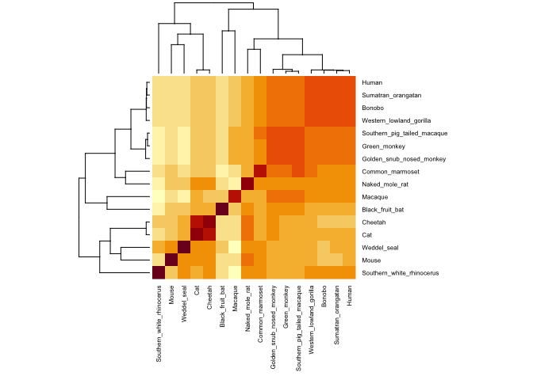

Find a gene assignment
================
Joan M. Valls Cuevas
6/4/2019

Question 6
----------

``` r
library(bio3d)
```

``` r
align_seqs <- read.fasta("muscle-I20190604-051354-0982-84809485-p1m.fst")
```

``` r
seq_align_matrix <- seqidentity(align_seqs)
```

``` r
heatmap(seq_align_matrix, margins = c(8,8), cexRow = 0.6, cexCol = 0.6 )
```



Generating a consensus sequence

``` r
one_seq <- consensus(align_seqs)
#write.fasta(one_seq$seq)

#one_seq$seq

#res <- blast.pdb(one_seq$seq)

write.fasta( seqs=one_seq$seq, file = "out.fa")
#blast.pdb("out.fa")
```

calculate row-wise maximum from identity matrix

``` r
seq2 <- "MELDH-TSGGLHAYPGPRGGPAAKPNVILQIGKCRAEMLEHVRRTHRHLLTEVSKQVERELKGLHRSVGKLESNLDGYVPTSDSQRWKKSIKACLCRCQETIANLERWVKREMHVWREVFYRLERWADRLES-GGKYPVGSEPARHTVSVGVGGPESYCHEADGYDYTVSPYAITPPPAAGELPGQEPAEAQQYQPW-PGEDGQPSPGVDTQIFEDPREFLSHLEEYLRQVGGSEEYWLSQIQNHMNGPAKKWWEFKQGSVKNWVEFKKEFLQYSEGTLSREAIQRELDLPQKQGEPLDQFLWRKRDLYQTLYVDA-EEEIIQYVVGTLQPKLKRFLRHPLPKTLEQLIQRGMEVQDDLEQAAEPA--GP-LPAEDEA----E-LTPA--SESVASDRTQPE"
```

``` r
write.fasta( seqs=seq2, file = "out2.fa")
```

``` r
#blast.pdb("out2.fa")
```

``` r
al <- align_seqs$ali
```
